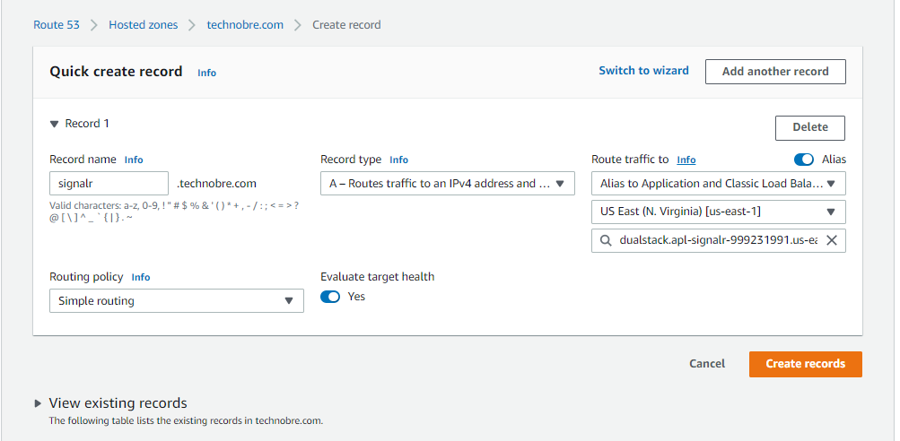
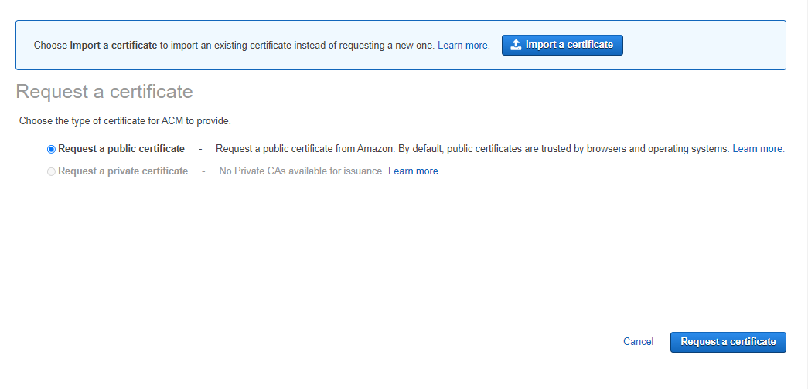
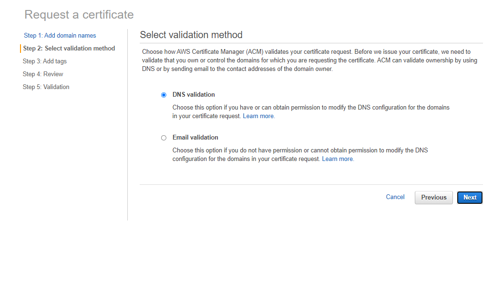
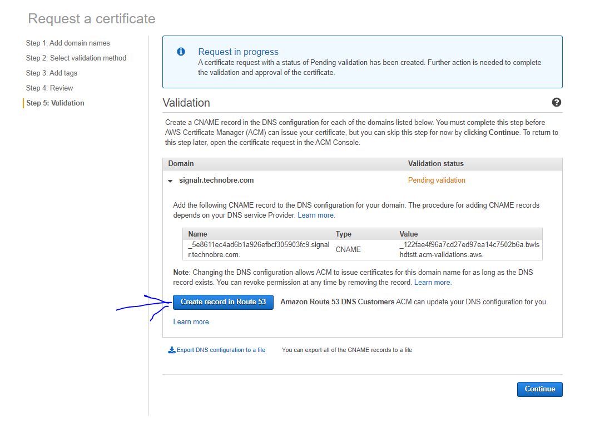
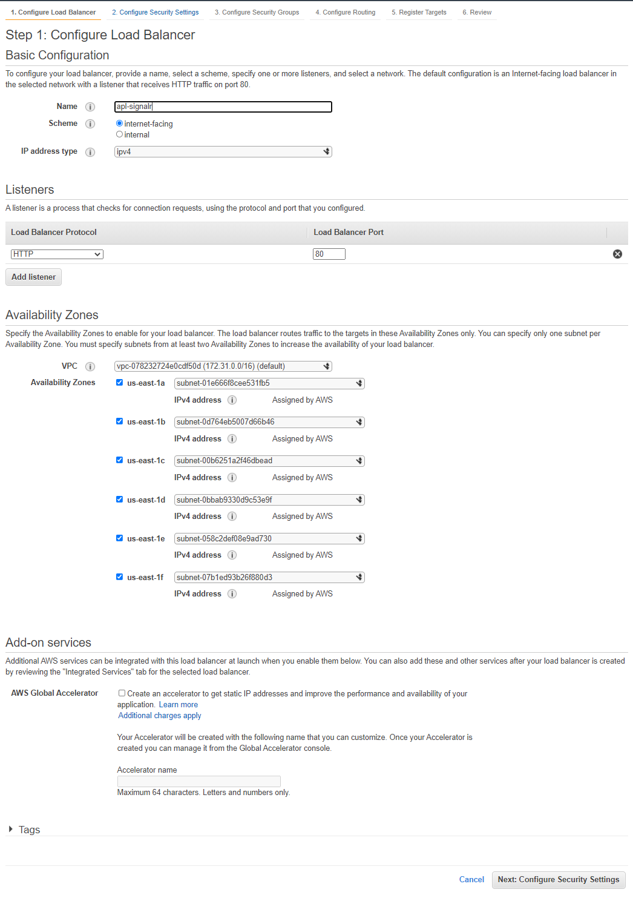
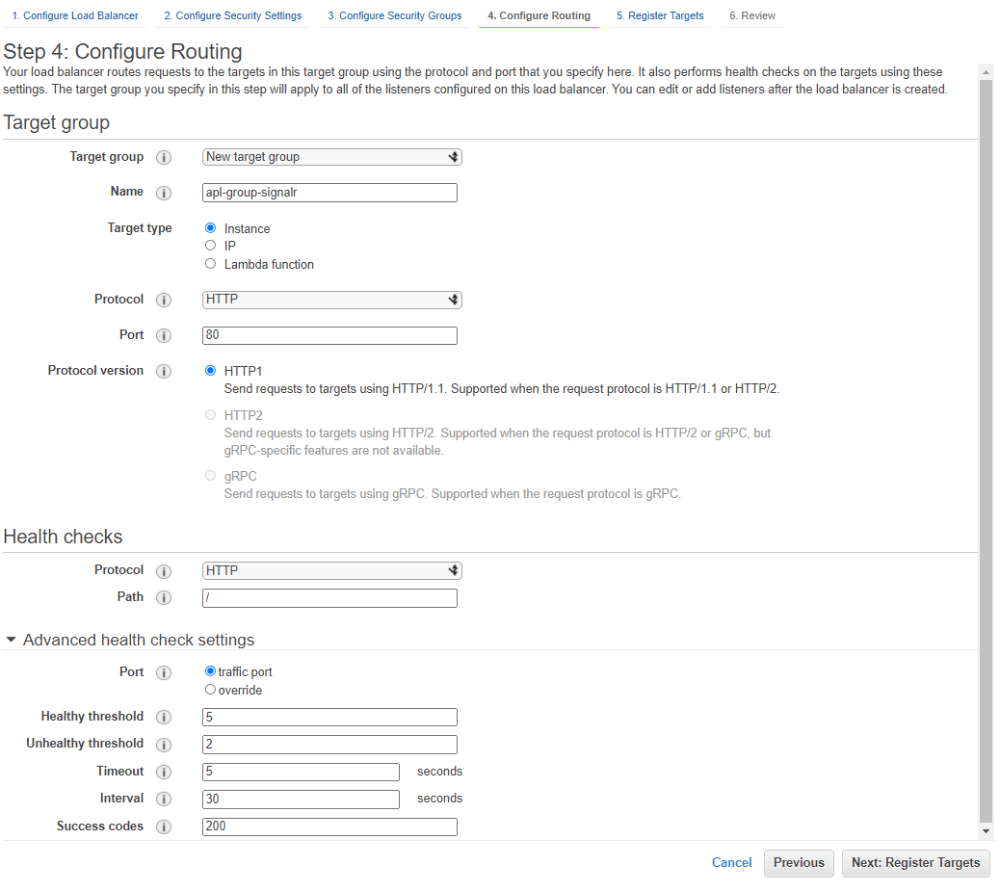
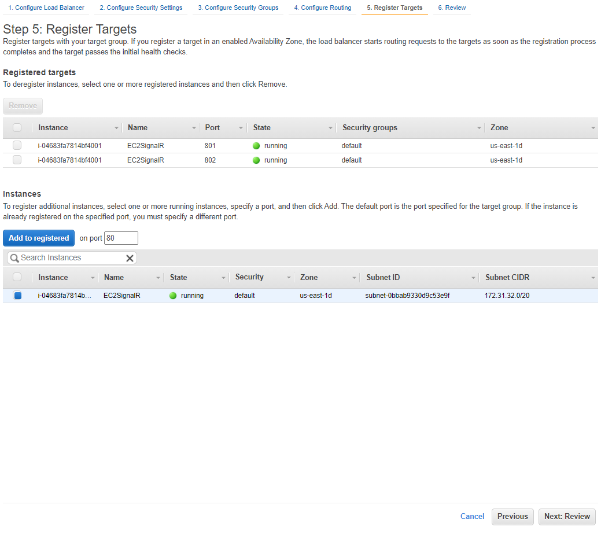
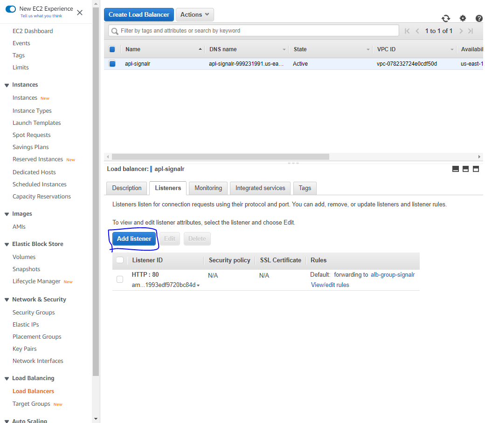
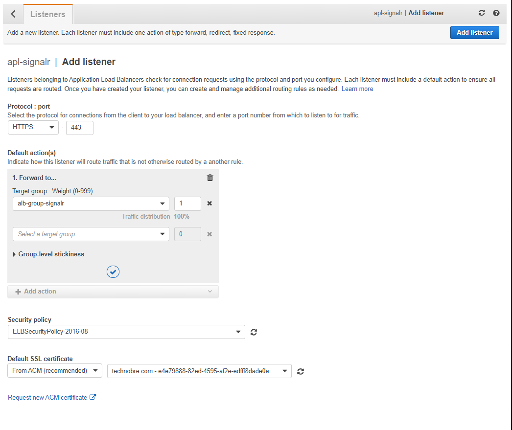

# Demo SignalR scalable on AWS
Demo of the SignalR scale-out on AWS. I am going to use the redis as a backplane to can scale a SingalR cluster horizontally.


## DEMO

### Prepare test envirament on AWS

#### EC2
Using "Amazon Linux 2".

**Prepare docker**
```bash
sudo yum update -y
sudo amazon-linux-extras install docker -y
sudo usermod -a -G docker ec2-user
```

> Reopen the terminal

**Keep preparing the docker**
```bash
sudo service docker start
sudo systemctl enable docker.service
sudo systemctl enable containerd.service
```

#### Route 53



#### ACM







#### Load balanacer

I am going to user the `Application Load Balancer`





> **In the example I am using two services on the same EC2 instance, but this is not recommended. I just used it to demonstrate the setup**

##### HTTPS on Load balanacer





### Docker network
Create a network to connect SignalR cluster with redis server
```bash
docker network create --driver bridge signalr-network
```

### Redis server

#### Run container
```bash
docker run --name server-redis -d -p 6379:6379 redis
```

#### Debug connections
```bash
docker exec -it server-redis bash
redis-cli client list
```


### SingalR Cluster

#### Connect SingalR server to Redis server

##### Install NuGet
```bash
Microsoft.AspNetCore.SignalR.StackExchangeRedis
```

##### Set RedisEndpoint configuration
In this example I am using the `appsettings.json`
```json
{
  "RedisEndpoint": "<container name on docker network>:6379",
  ...
}
```

##### On Startup.cs file
```csharp
..
public void ConfigureServices(IServiceCollection services)
{
    services
        .AddSignalR()
        .AddStackExchangeRedis(options => {
            options.Configuration.ClientName = "DemoSignalR";
            options.Configuration.EndPoints.Add(
                this._configuration.GetValue<string>("RedisEndpoint")
            );
        });
}
```

#### Client configuration
If you only use WebSockets, you can turn Negotiation off and configure the client to work only with WebSockets.
If you will use Server-Sent Events or Long Polling, you must configure your load balancer to support sticky sessions.

```JavaScript
const connection = new signalR.HubConnectionBuilder()
    .withUrl(url, {
        skipNegotiation: true,
        transport: signalR.HttpTransportType.WebSockets
    })
    .build();
```

#### Build docker image
```bash
cd src/Demo.dotnet.SignalR.Server
docker build -f ./Dockerfile --force-rm -t technobre/server-signalr .

cd ../..

cd src/Demo.Client.dotnet
docker build -f ./Dockerfile --force-rm -t technobre/client-signalr .
```


#### Run containers
```bash
docker container run -d --name=server-signalr1 --net signalr-network -p 801:80 -t technobre/server-signalr .

docker container run -d --name=server-signalr2 --net signalr-network -p 802:80 -t technobre/server-signalr .

docker container run -d --name=client-signalr -p 8080:80 -t technobre/client-signalr .
```

#### Connect to server
``` bash
http://<ec2-public-api>:801/swagger/index.html
```


## Reference links
- [Set up a Redis backplane for SignalR scale-out](https://docs.microsoft.com/en-us/aspnet/core/signalr/redis-backplane?view=aspnetcore-5.0)


## Contribution

*Help me to help others*

***Thanks for the contributions from:***
- [@Gustavo Silva](https://www.kaggle.com/gustavofmsilva)
- [@Ruben Miquelino](https://github.com/rubenptm)


## LICENSE

[MIT](https://github.com/NelsonBN/demo-aws-signalr-scalable/blob/main/LICENSE)